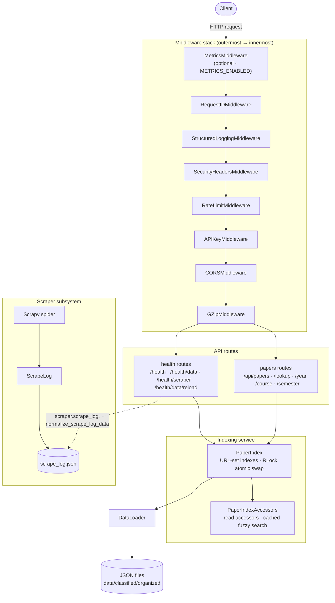

# Architecture Overview

Middleware is registered inner→outer in `app_v2/main.py`, so the request flow above runs outermost→innermost: `RequestID` wraps everything; `SecurityHeaders` wraps auth so 401/403 still carry headers; `RateLimit` wraps `APIKey` so failed auth counts toward the limit; `GZip` is innermost. `MetricsMiddleware` is added only when `LIBRARY_PORTAL_METRICS_ENABLED` and sits outermost.

## Data Flow

1. `config/config_v2.py` exposes a `settings` singleton (env prefix `LIBRARY_PORTAL_`) loaded at import.
2. On startup, the FastAPI `lifespan` builds the module-level `paper_index` singleton by running `DataLoader` over `settings.DATA_DIRECTORY` (orjson parsing, dedup by `url`). A load failure degrades to an empty index instead of crashing.
3. `PaperIndex` builds URL-set indexes (year, semester, course, program, program_abbrev, paper_type, degree_type, stream) plus unique-value and count caches; `PaperIndexAccessors` provides read accessors and `thefuzz` fuzzy search cached via `@lru_cache`.
4. `GET /api/papers` intersects the relevant filter URL-sets, optionally applies fuzzy `search`, then sorts (`year`/`semester`/`relevance`, `asc`/`desc`) and paginates with `limit`/`offset`.
5. `POST /health/data/reload` returns `202 Accepted` and, in a background task, builds a brand-new `PaperIndex` and swaps it in atomically under an `RLock`, so in-flight requests are never interrupted.
6. `GET /health/scraper` reads and normalizes `scrape_log.json` via `scraper.scrape_log.normalize_scrape_log_data` (a deliberate cross-package contract).

## Subsystems

- `config/config_v2.py` — `settings` singleton (pydantic `BaseSettings`).
- `app_v2/data_loader.py` — `DataLoader`: orjson load + URL dedup.
- `app_v2/services/indexing.py` + `index_accessors.py` — `PaperIndex` / `PaperIndexAccessors`: URL-set indexes, atomic reload, cached fuzzy search.
- `app_v2/routes/` — `papers.py` and `health.py` endpoint handlers.
- `app_v2/middleware/` — auth, rate limiting, structured logging, request-id, security headers.
- `scraper/` — Scrapy crawler; `scrape_log.py` defines `ScrapeLog` and `normalize_scrape_log_data`.
